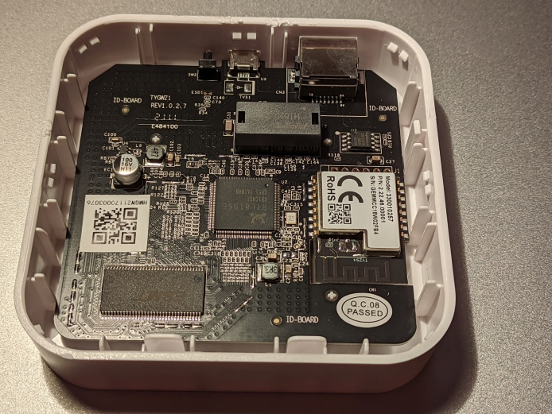
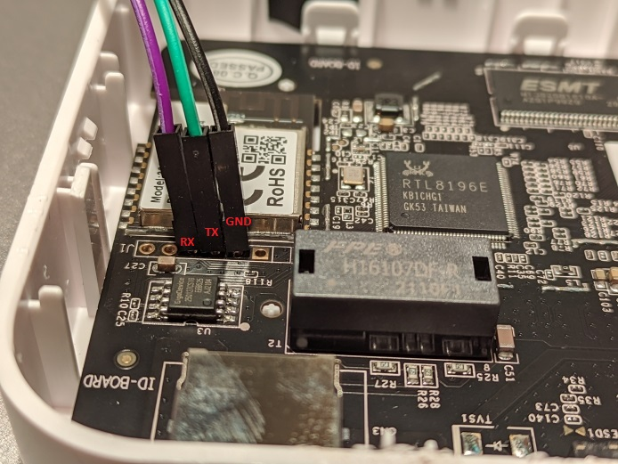

# Hardware hacking: SilverCrest Zigbee Gateway SGWZ1A1 



## Content

* [Usefull sources](#usefull-sources)
* [Serial console](#serial-console)
* [System walkthrough](#system-walkthrough)
* [Network discovery](#network-discovery)
  * [TCP enumeration scan](#tcp-enumeration-scan)
  * [SSH enumeration](#ssh-enumeration)
  * [SSH audit](#ssh-audit)
  * [SSH scan](#ssh-scan)
* [TO DO](#to-do)

## Usefull sources

* All credit for **initial research** goes to **Paul Banks**:
  * Original blog post is here: <https://paulbanks.org/projects/lidl-zigbee>
  * Github repo with used code: <https://github.com/banksy-git/lidl-gateway-freedom>
* Tutorial by Black Adder: <https://zigbee.blakadder.com/Lidl_TYGWZ-01.html>
* Home Assistant Community forum: <https://community.home-assistant.io/t/hacking-the-silvercrest-lidl-tuya-smart-home-gateway/270934>
* Czech tutorial by ElvisEK: <https://www.elvisek.cz/2021/08/zigbee-modifikace-lidl-silvercrest-zb-gateway/>

## Serial console

Location of UART pins on PCB:

]

Connect with: `sudo screen /dev/ttyUSB0 38400`

Full boot log after device is power up (ethernet is connected):
```
Booting...
 

@@@@@@@@@@@@@@@@@@@@@@@@@@@@@@@@@@@@@@@@@@@@@@@@@@@@@@@@@@@@@@@@@@@@@@@@@@@@@@@@

@

@ chip__no chip__id mfr___id dev___id cap___id size_sft dev_size chipSize

@ 0000000h 0c84018h 00000c8h 0000040h 0000018h 0000000h 0000018h 1000000h

@ blk_size blk__cnt sec_size sec__cnt pageSize page_cnt chip_clk chipName

@ 0010000h 0000100h 0001000h 0001000h 0000100h 0000010h 000004eh GD25Q128

@ 

@@@@@@@@@@@@@@@@@@@@@@@@@@@@@@@@@@@@@@@@@@@@@@@@@@@@@@@@@@@@@@@@@@@@@@@@@@@@@@@@

DDR1:32MB

 

---RealTek(RTL8196E)at 2020.04.28-13:58+0800 v3.4T-pre2 [16bit](380MHz)

P0phymode=01, embedded phy

check_image_header  return_addr:05010000 bank_offset:00000000

no sys signature at 00010000!

P0phymode=01, embedded phy


---Ethernet init Okay!

tuya:start receive production test frame ...

Jump to image start=0x80c00000...

decompressing kernel:
Uncompressing Linux... done, booting the kernel.
done decompressing kernel.
start address: 0x80003780
Linux version 3.10.90 (dingsl@dingsl-pc) (gcc version 4.6.4 (Realtek RSDK-4.6.4 Build 2080) ) #10 Tue Apr 28 14:03:14 CST 2020
CPU revision is: 0000cd01
Determined physical RAM map:
 memory: 02000000 @ 00000000 (usable)
Zone ranges:
  Normal   [mem 0x00000000-0x01ffffff]
Movable zone start for each node
Early memory node ranges
  node   0: [mem 0x00000000-0x01ffffff]
icache: 16kB/16B, dcache: 8kB/16B, scache: 0kB/0B
Built 1 zonelists in Zone order, mobility grouping on.  Total pages: 8128
Kernel command line:  console=ttyS0,38400 root=/dev/mtdblock2 
PID hash table entries: 128 (order: -3, 512 bytes)
Dentry cache hash table entries: 4096 (order: 2, 16384 bytes)
Inode-cache hash table entries: 2048 (order: 1, 8192 bytes)
Memory: 27700k/32768k available (2479k kernel code, 5068k reserved, 525k data, 192k init, 0k highmem)
SLUB: HWalign=32, Order=0-3, MinObjects=0, CPUs=1, Nodes=1
NR_IRQS:128
console [ttyS0] enabled
Calibrating delay loop... 378.47 BogoMIPS (lpj=1892352)
pid_max: default: 4096 minimum: 301
Mount-cache hash table entries: 512
reg e0=0
reg e1=0
reg e2=0
reg e3=0
reg e4=0
reg e5=0
reg e6=0
reg e7=0
reg f0=0
reg f1=0
reg f2=0
reg f3=0
reg f4=0
reg f5=0
reg f6=0
NET: Registered protocol family 16
bio: create slab <bio-0> at 0
NET: Registered protocol family 2
TCP established hash table entries: 512 (order: 0, 4096 bytes)
TCP bind hash table entries: 512 (order: -1, 2048 bytes)
TCP: Hash tables configured (established 512 bind 512)
TCP: reno registered
UDP hash table entries: 256 (order: 0, 4096 bytes)
UDP-Lite hash table entries: 256 (order: 0, 4096 bytes)
NET: Registered protocol family 1
squashfs: version 4.0 (2009/01/31) Phillip Lougher
jffs2: version 2.2. (NAND) © 2001-2006 Red Hat, Inc.
msgmni has been set to 54
Block layer SCSI generic (bsg) driver version 0.4 loaded (major 254)
io scheduler noop registered
io scheduler deadline registered
io scheduler cfq registered (default)
Serial: 8250/16550 driver, 2 ports, IRQ sharing disabled
serial8250: ttyS0 at MMIO 0x18002000 (irq = 9) is a 16550A
serial8250: ttyS1 at MMIO 0x18002100 (irq = 13) is a 16550A
Realtek GPIO Driver for Flash Reload Default
tuya_gpio_init ok, scan expire time:50
SPI INIT
 ------------------------- Force into Single IO Mode ------------------------ 
|No chipID  Sft chipSize blkSize secSize pageSize sdCk opCk      chipName    |
| 0 c84018h  0h 1000000h  10000h  10000h     100h   84    0          GD25Q128|
 ---------------------------------------------------------------------------- 
SPI flash(GD25Q128) was found at CS0, size 0x1000000
boot+cfg offset=0x0 size=0x20000 erasesize=0x10000
linux offset=0x20000 size=0x1e0000 erasesize=0x10000
rootfs offset=0x200000 size=0x200000 erasesize=0x10000
tuya-label offset=0x400000 size=0x20000 erasesize=0x10000
jffs2-fs offset=0x420000 size=0xbe0000 erasesize=0x10000
5 rtkxxpart partitions found on MTD device flash_bank_1
Creating 5 MTD partitions on "flash_bank_1":
0x000000000000-0x000000020000 : "boot+cfg"
0x000000020000-0x000000200000 : "linux"
0x000000200000-0x000000400000 : "rootfs"
0x000000400000-0x000000420000 : "tuya-label"
0x000000420000-0x000001000000 : "jffs2-fs"
PPP generic driver version 2.4.2
nf_conntrack version 0.5.0 (432 buckets, 1728 max)
ip_tables: (C) 2000-2006 Netfilter Core Team
TCP: cubic registered
NET: Registered protocol family 17
l2tp_core: L2TP core driver, V2.0
8021q: 802.1Q VLAN Support v1.8
Realtek FastPath:v1.03

Probing RTL819X NIC-kenel stack size order[1]...
eth0 added. vid=9 Member port 0x10f...
eth1 added. vid=8 Member port 0x10...
[peth0] added, mapping to [eth1]...
VFS: Mounted root (squashfs filesystem) readonly on device 31:2.
Freeing unused kernel memory: 192K (802f0000 - 80320000)

init started: BusyBox v1.13.4 (2020-04-28 13:57:36 CST)
Set power startcmd read


b8000038: 2794A104  0000000F    00000042  00000018    '”ˇ        B    
cmd write
Write memory 0xb8000038 dat 0x1794a104: 0x1794a104
Set power end
udhcpc (v1.13.4) started
Sending discover...
Sending select for 10.0.0.48...
Lease of 10.0.0.48 obtained, lease time 86399

Please press Enter to activate this console. Tuya Gateway Application Normal Srart /tuya/tuya_start.sh UserAppRunDir:
set defult run_dir:/tuya
TY_ENV_APP_RUN_DIR=/tuya
deleting routers
route: SIOCDELRT: No such process
adding dns <REDACTED>
adding dns <REDACTED>
get user cfg file error, load defult cfg file
load platform configure file:/tuya/def.cfg
start.conf is exist
udhcpc (v1.13.4) started
current run dir:/tuya/tuya_user2
Sending discover...
Sending select for 10.0.0.48...
tuya_start_children.sh:UserAppRunDir:/tuya JsonFile Path:/tuya/def.cfg [engineer_mode: ]
Lease of 10.0.0.48 obtained, lease time 86399
deleting routers
route: SIOCDELRT: No such process
adding dns <REDACTED>
adding dns <REDACTED>
killall: app_detect.sh: no process killed
killall: tyZ3Gw: no process killed
killall: log_detect.sh: no process killed
killall: process_monitor.sh: no process killed
killall: tyZ3Gw: no process killed
cat: can't open '/tuya/eng_mode': No such file or directory
no eng file

```

Press ENTER to get new line. 

Serial console is password protected:
```
tuya-linux login: root
Password: 
Tuya Linux version 1.0
Jan  1 00:00:52 login[122]: root login on 'console'
```

To get `root` password, follow steps on this page: <https://paulbanks.org/projects/lidl-zigbee/root>

* **Remember: every device has own pair of keys used for generating root password.** My password mentioned below will definitely not work for your device!

1. Here is my record of getting root password: 
```
Booting...

@@@@@@@@@@@@@@@@@@@@@@@@@@@@@@@@@@@@@@@@@@@@@@@@@@@@@@@@@@@@@@@@@@@@@@@@@@@@@@@@
@
@ chip__no chip__id mfr___id dev___id cap___id size_sft dev_size chipSize
@ 0000000h 0c84018h 00000c8h 0000040h 0000018h 0000000h 0000018h 1000000h
@ blk_size blk__cnt sec_size sec__cnt pageSize page_cnt chip_clk chipName
@ 0010000h 0000100h 0001000h 0001000h 0000100h 0000010h 000004eh GD25Q128
@
@@@@@@@@@@@@@@@@@@@@@@@@@@@@@@@@@@@@@@@@@@@@@@@@@@@@@@@@@@@@@@@@@@@@@@@@@@@@@@@@
DDR1:32MB

---RealTek(RTL8196E)at 2020.04.28-13:58+0800 v3.4T-pre2 [16bit](380MHz)
P0phymode=01, embedded phy
check_image_header  return_addr:05010000 bank_offset:00000000
no sys signature at 00010000!

---Escape booting by user
P0phymode=01, embedded phy

---Ethernet init Okay!
<RealTek>
Unknown command !
<RealTek>FLR 80000000 401802 16
Flash read from 00401802 to 80000000 with 00000016 bytes        ?
(Y)es , (N)o ? --> Y
Flash Read Successed!
<RealTek>DW 80000000 4
80000000:       783F4230        516F4E36        24573C51        246F7266
<RealTek>FLR 80000000 402002 32
Flash read from 00402002 to 80000000 with 00000032 bytes        ?
(Y)es , (N)o ? --> Y
Flash Read Successed!
<RealTek>DW 80000000 8
80000000:       333F0901        F41AD9C3        FEB79B44        81A78E7B
80000010:       846EEB89        17876D75        AEFBE84B        FF8E5EE5
<RealTek>
```

2. Used script: <https://github.com/banksy-git/lidl-gateway-freedom/blob/master/scripts/lidl_auskey_decode.py>

Output of `python3 lidl_auskey_decode.py` command:
```
Enter KEK hex string line>80000000:       783F4230        516F4E36        24573C51        246F7266
Encoded aus-key as hex string line 1>80000000:       333F0901        F41AD9C3        FEB79B44        81A78E7B
Encoded aus-key as hex string line 2>80000010:       846EEB89        17876D75        AEFBE84B        FF8E5EE5
Auskey: yJ0Adfez6nHEnmRSsIQB0gsvVu3O5u6o
Root password: Vu3O5u6o
```

3. Obtained root password can be used in UART console or for SSH connection. From Linux machine you can log in with this command:
```
ssh -p 2333 -oKexAlgorithms=+diffie-hellman-group1-sha1 -oHostKeyAlgorithms=+ssh-rsa root@10.0.0.48
```

## System walkthrough

Content of `/` on filesystem:

```
drwxrwxr-x   14 1000     1000          186 Apr 30  2020 .
drwxrwxr-x   14 1000     1000          186 Apr 30  2020 ..
drwxrwxr-x    2 1000     1000         1117 Apr 30  2020 bin
drwxr-xr-x    4 root     0               0 Jan  1 00:00 dev
drwxrwxr-x    4 1000     1000          189 Apr 30  2020 etc
drwxrwxr-x    2 1000     1000           33 Apr 30  2020 home
lrwxrwxrwx    1 1000     1000            8 Apr 30  2020 init -> bin/init
drwxrwxr-x    2 1000     1000          997 Apr 30  2020 lib
drwxrwxr-x    2 1000     1000            3 Apr 30  2020 mnt
dr-xr-xr-x   60 root     0               0 Jan  1 00:00 proc
lrwxrwxrwx    1 1000     1000            9 Apr 30  2020 root -> /var/root
drwxrwxr-x    2 1000     1000            3 Apr 30  2020 sbin
dr-xr-xr-x   11 root     0               0 Jan  1 00:00 sys
lrwxrwxrwx    1 1000     1000            8 Apr 30  2020 tmp -> /var/tmp
drwxr-xr-x    9 root     0               0 Jan  1 00:00 tuya
drwxrwxr-x    3 1000     1000           26 Apr 30  2020 usr
drwxr-xr-x   10 root     0               0 Jan  1 00:00 var
```

Content of `/tuya`:
```
drwxr-xr-x    9 root     0               0 Jan  1  1970 .
drwxrwxr-x   14 1000     1000          186 Apr 30  2020 ..
-rwxrwxr-x    1 1000     1000       189774 Apr 21  2020 NcpUpgrade.ota
-rwxrwxr-x    1 1000     1000         9226 Apr 21  2020 app_upgrade.sh
drwxrwxr-x    2 1000     1000            0 Jan  1  1970 config
-rwxrwxr-x    1 1000     1000          453 Dec 28 16:05 def.cfg
-rw-r--r--    1 root     0              15 Dec 28 16:06 dump.txt
-rwxrwxr-x    1 1000     1000         2161 Dec 28 16:05 json_parser.sh
drwxr-xr-x    2 root     0               0 Jan  1  1970 log_dir
-rw-r--r--    1 root     0               7 Dec 28 16:06 log_index_file
-rw-r--r--    1 root     0           13388 Jan  1  1970 pro_mon_save_file
drwxr-xr-x    2 root     0               0 Jan  1  1970 rcdDb
drwxr-xr-x    2 root     0               0 Jan  1  1970 ssh
-rwxrwxr-x    1 1000     1000          936 Dec 28 16:05 ssh_monitor.sh
-rw-r--r--    1 root     0              32 Dec 28 16:05 start.conf
-rwxrwxr-x    1 1000     1000          639 Dec 28 16:05 start_record.sh
-rw-r--r--    1 root     0           33532 Jan  8 17:30 start_record_file
-rwxr-xr-x    1 root     0             443 Dec 28 16:05 tuya_net_start.sh
-rwxrwxr-x    1 1000     1000         4266 Dec 28 16:05 tuya_start.sh
drwxrwxr-x    2 1000     1000            0 Apr 21  2020 tuya_user1
drwxr-xr-x    5 root     0               0 Dec 28 16:06 tuya_user2
-rwxr-xr-x    1 root     0          350472 Dec 28 16:05 tuyadropbear
-rwxrwxr-x    1 1000     1000        27788 Dec 28 16:05 tuyamtd
-rwxrwxr-x    1 1000     1000          883 Dec 28 16:05 udhcpc.script
-rw-r--r--    1 root     0             307 Jan  1  1970 zigbeeNetInfo.txt
-rw-r--r--    1 root     0             307 Jan  1  1970 zigbeeNetInfo_bak.txt
-rw-r--r--    1 root     0               1 Jan  1  1970 zigbee_net_valid_flag
```
Content of `ssh_monitor.sh`. This is simple anti brute force protection of login. It monitors number of failed login attempts and increasing `failed_cnt` counter every time you enter wrong credentials. As result, time between atempts increasing rapidly (see `sleep_time` variable when Dropbear server is not running):
```bash
#!/bin/sh
SSH_FAILED_CNT_FILE=/tuya/ssh/cnt

sleep 3
mkdir -p /tuya/ssh

failed_cnt=0
sleep_time=0

if [ -f "$SSH_FAILED_CNT_FILE" ];then
                failed_cnt=`cat $SSH_FAILED_CNT_FILE`
fi

if [ ! -z "$1" ];then
    test_login_flag=1

        killall tuyadropbear
        sleep 1
        rm -f /var/run/dropbear.tuya.pid

        let failed_cnt=$failed_cnt+1
        echo $failed_cnt > $SSH_FAILED_CNT_FILE

        if [ $failed_cnt -gt 5 ];then
                let sleep_time=432000
        elif [ $failed_cnt -eq 1 ];then
                let sleep_time=90
        elif [ $failed_cnt -eq 2 ];then
                let sleep_time=300
        elif [ $failed_cnt -eq 3 ];then
                let sleep_time=3600
        elif [ $failed_cnt -eq 4 ];then
                let sleep_time=86400
        elif [ $failed_cnt -eq 5 ];then
                let sleep_time=172800
        fi
else
        killall dropbear
        let sleep_time=21600*$failed_cnt
fi

echo "[tuya failed login] $failed_cnt times, sleep $sleep_time secs." >> /tmp/tuya.log
sleep $sleep_time

/tuya/tuyadropbear -P /var/run/dropbear.tuya.pid -p 2333 -K 300 -T 1
```

System is powered by BusyBox:
```
BusyBox v1.13.4 (2020-04-28 13:57:36 CST) multi-call binary
Copyright (C) 1998-2008 Erik Andersen, Rob Landley, Denys Vlasenko
and others. Licensed under GPLv2.
See source distribution for full notice.

Usage: busybox [function] [arguments]...
   or: function [arguments]...

  BusyBox is a multi-call binary that combines many common Unix
  utilities into a single executable.  Most people will create a
  link to busybox for each function they wish to use and BusyBox
  will act like whatever it was invoked as!

Currently defined functions:
  adduser, ar, ash, awk, bunzip2, bzcat, bzip2, cat, chmod, chpasswd,
  cp, cpio, cut, date, dd, df, dirname, dmesg, dpkg, dpkg-deb, echo,
  expr, false, free, grep, gunzip, gzip, halt, head, hostname, ifconfig,
  init, ip, kill, killall, klogd, ln, login, ls, lzmacat, md5sum,
  mkdir, mknod, mount, mv, passwd, pgrep, ping, poweroff, ps, pwd,
  reboot, renice, rm, route, rpm, rpm2cpio, sed, sh, sleep, stty,
  syslogd, tail, tar, tftp, top, true, udhcpc, umount, uncompress,
  unlzma, unzip, uptime, vconfig, vi, wc, xargs, zcat
```

Hardware architecture (`cat /proc/cpuinfo`):
```
system type    : RTL8196E
machine      : Unknown
processor    : 0
cpu model    : 52481
BogoMIPS    : 378.47
tlb_entries    : 32
mips16 implemented  : yes
```

Running processes (`ps`):
```
  PID USER       VSZ STAT COMMAND
    1 root      1292 S    init
    2 root         0 SW   [kthreadd]
    3 root         0 SW<  [ksoftirqd/0]
    4 root         0 SW   [kworker/0:0]
    5 root         0 SW<  [kworker/0:0H]
    6 root         0 SW   [kworker/u2:0]
    7 root         0 SW<  [khelper]
    8 root         0 SW<  [writeback]
    9 root         0 SW<  [bioset]
   10 root         0 SW<  [crypto]
   11 root         0 SW<  [kblockd]
   12 root         0 SW   [kswapd0]
   13 root         0 SW   [kworker/0:1]
   14 root         0 SW   [fsnotify_mark]
   20 root         0 SW   [mtdblock0]
   21 root         0 SW   [mtdblock1]
   22 root         0 SW   [mtdblock2]
   23 root         0 SW   [mtdblock3]
   24 root         0 SW   [mtdblock4]
   25 root         0 SW<  [deferwq]
   26 root         0 SW   [kworker/u2:1]
   27 root         0 SW<  [kworker/0:1H]
   96 root         0 SWN  [jffs2_gcd_mtd4]
  121 root      1296 S    -sh
  217 root      1288 S    /bin/sh ./app_detect.sh ./tyZ3Gw /tuya /tuya/def.cfg
  218 root      1600 S    /tuya/tuyadropbear -P /var/run/dropbear.tuya.pid -p 2
  222 root      1296 S    /bin/sh ./log_detect.sh /tmp/tuya.log 60
  232 root      1292 S    /bin/sh ./process_monitor.sh /tuya /tuya/def.cfg
  238 root      7440 S    ./tyZ3Gw /tuya/tuya_user2 /tuya/def.cfg
  253 root      7440 S    ./tyZ3Gw /tuya/tuya_user2 /tuya/def.cfg
  254 root      7440 S    ./tyZ3Gw /tuya/tuya_user2 /tuya/def.cfg
  255 root      7440 S    ./tyZ3Gw /tuya/tuya_user2 /tuya/def.cfg
  256 root      7440 S    ./tyZ3Gw /tuya/tuya_user2 /tuya/def.cfg
  257 root      7440 S    ./tyZ3Gw /tuya/tuya_user2 /tuya/def.cfg
  258 root      7440 S    ./tyZ3Gw /tuya/tuya_user2 /tuya/def.cfg
  259 root      7440 S    ./tyZ3Gw /tuya/tuya_user2 /tuya/def.cfg
  260 root      7440 S    ./tyZ3Gw /tuya/tuya_user2 /tuya/def.cfg
  261 root      7440 S    ./tyZ3Gw /tuya/tuya_user2 /tuya/def.cfg
  262 root      7440 S    ./tyZ3Gw /tuya/tuya_user2 /tuya/def.cfg
  268 root      7440 S    ./tyZ3Gw /tuya/tuya_user2 /tuya/def.cfg
  269 root      7440 S    ./tyZ3Gw /tuya/tuya_user2 /tuya/def.cfg
  270 root      7116 S    ./tyZ3Gw /tuya/tuya_user2 /tuya/def.cfg
  271 root      7440 S    ./tyZ3Gw /tuya/tuya_user2 /tuya/def.cfg
  272 root      7116 S    ./tyZ3Gw /tuya/tuya_user2 /tuya/def.cfg
  273 root      7116 S    ./tyZ3Gw /tuya/tuya_user2 /tuya/def.cfg
  278 root      7440 S    ./tyZ3Gw /tuya/tuya_user2 /tuya/def.cfg
  279 root      7440 S    ./tyZ3Gw /tuya/tuya_user2 /tuya/def.cfg
  283 root      7440 S    ./tyZ3Gw /tuya/tuya_user2 /tuya/def.cfg
  284 root      7440 S    ./tyZ3Gw /tuya/tuya_user2 /tuya/def.cfg
  285 root      7440 S    ./tyZ3Gw /tuya/tuya_user2 /tuya/def.cfg
  286 root      7440 S    ./tyZ3Gw /tuya/tuya_user2 /tuya/def.cfg
  293 root      7440 S    ./tyZ3Gw /tuya/tuya_user2 /tuya/def.cfg
  298 root      7440 S    ./tyZ3Gw /tuya/tuya_user2 /tuya/def.cfg
  303 root      1288 S    udhcpc -i eth1 -s /tuya/udhcpc.script -p /var/run/udh
 1959 root      1280 S    sleep 60
 1960 root      1664 S    /tuya/tuyadropbear -P /var/run/dropbear.tuya.pid -p 2
 1967 root      1280 S    sleep 20
 1971 root      1292 S    -sh
```

## Network discovery

### TCP enumeration scan

Used: `Nmap 7.92`.

Performed with `nmap -v -sC -sV -p- -oA nmap/full-tcp-scan 10.0.0.48` command:

```
Nmap scan report for 10.0.0.48
Host is up (0.014s latency).
Not shown: 65532 closed tcp ports (reset)
PORT      STATE SERVICE VERSION
2333/tcp  open  ssh     Dropbear sshd 2018.76 (protocol 2.0)
6668/tcp  open  irc?
|_irc-info: Unable to open connection
12130/tcp open  unknown
MAC Address: 10:D5:61:FC:63:62 (Tuya Smart)
Service Info: OS: Linux; CPE: cpe:/o:linux:linux_kernel

```

`tcp/2333` - Dropbear 2018.76 SSH server.

`tcp/6668` - Officially is port 6668 is assigned by IANA for Internet Relay Chat (IRC) service but this is not this case. Actualy this port belongs to **TuyAPI**, example of library: <https://github.com/codetheweb/tuyapi>

`tcp/12130` - Unknown service. Maybe some discovery protocol for mobile app?


### SSH enumeration

Used: `Nmap 7.92`.

Performed with `nmap -v -p2333 -n -sV --script ssh2-enum-algos -o ssh-enum 10.0.0.48` command:

```
PORT     STATE SERVICE VERSION
2333/tcp open  ssh     Dropbear sshd 2018.76 (protocol 2.0)
| ssh2-enum-algos: 
|   kex_algorithms: (8)
|       curve25519-sha256
|       curve25519-sha256@libssh.org
|       ecdh-sha2-nistp521
|       ecdh-sha2-nistp384
|       ecdh-sha2-nistp256
|       diffie-hellman-group14-sha256
|       diffie-hellman-group14-sha1
|       kexguess2@matt.ucc.asn.au
|   server_host_key_algorithms: (2)
|       ssh-rsa
|       ssh-dss
|   encryption_algorithms: (6)
|       aes128-ctr
|       aes256-ctr
|       aes128-cbc
|       aes256-cbc
|       3des-ctr
|       3des-cbc
|   mac_algorithms: (3)
|       hmac-sha1-96
|       hmac-sha1
|       hmac-sha2-256
|   compression_algorithms: (2)
|       zlib@openssh.com
|_      none
Service Info: OS: Linux; CPE: cpe:/o:linux:linux_kernel

```

### SSH audit

Tool `ssh_adit`: <https://github.com/jtesta/ssh-audit>

Output of `./ssh-audit.py -p 2333 10.0.0.48` command: 
```
# general
(gen) banner: SSH-2.0-dropbear_2018.76
(gen) software: Dropbear SSH 2018.76
(gen) compatibility: OpenSSH 7.4+ (some functionality from 6.6), Dropbear SSH 2018.76+
(gen) compression: enabled (zlib@openssh.com)

# security
(cve) CVE-2018-15599                 -- (CVSSv2: 5.0) remote users may enumerate users on the system

# key exchange algorithms
(kex) curve25519-sha256              -- [info] available since OpenSSH 7.4, Dropbear SSH 2018.76
(kex) curve25519-sha256@libssh.org   -- [info] available since OpenSSH 6.5, Dropbear SSH 2013.62
(kex) ecdh-sha2-nistp521             -- [fail] using weak elliptic curves
                                     `- [info] available since OpenSSH 5.7, Dropbear SSH 2013.62
(kex) ecdh-sha2-nistp384             -- [fail] using weak elliptic curves
                                     `- [info] available since OpenSSH 5.7, Dropbear SSH 2013.62
(kex) ecdh-sha2-nistp256             -- [fail] using weak elliptic curves
                                     `- [info] available since OpenSSH 5.7, Dropbear SSH 2013.62
(kex) diffie-hellman-group14-sha256  -- [info] available since OpenSSH 7.3, Dropbear SSH 2016.73
(kex) diffie-hellman-group14-sha1    -- [warn] using weak hashing algorithm
                                     `- [info] available since OpenSSH 3.9, Dropbear SSH 0.53
(kex) kexguess2@matt.ucc.asn.au      -- [info] available since Dropbear SSH 2013.57

# host-key algorithms
(key) ssh-rsa (2048-bit)             -- [fail] using weak hashing algorithm
                                     `- [info] available since OpenSSH 2.5.0, Dropbear SSH 0.28
                                     `- [info] a future deprecation notice has been issued in OpenSSH 8.2: https://www.openssh.com/txt/release-8.2
(key) ssh-dss                        -- [fail] using small 1024-bit modulus
                                     `- [fail] removed (in server) and disabled (in client) since OpenSSH 7.0, weak algorithm
                                     `- [warn] using weak random number generator could reveal the key
                                     `- [info] available since OpenSSH 2.1.0, Dropbear SSH 0.28

# encryption algorithms (ciphers)
(enc) aes128-ctr                     -- [info] available since OpenSSH 3.7, Dropbear SSH 0.52
(enc) aes256-ctr                     -- [info] available since OpenSSH 3.7, Dropbear SSH 0.52
(enc) aes128-cbc                     -- [fail] removed (in server) since OpenSSH 6.7, unsafe algorithm
                                     `- [warn] using weak cipher mode
                                     `- [info] available since OpenSSH 2.3.0, Dropbear SSH 0.28
(enc) aes256-cbc                     -- [fail] removed (in server) since OpenSSH 6.7, unsafe algorithm
                                     `- [warn] using weak cipher mode
                                     `- [info] available since OpenSSH 2.3.0, Dropbear SSH 0.47
(enc) 3des-ctr                       -- [fail] using weak cipher
                                     `- [info] available since Dropbear SSH 0.52
(enc) 3des-cbc                       -- [fail] removed (in server) since OpenSSH 6.7, unsafe algorithm
                                     `- [warn] disabled (in client) since OpenSSH 7.4, unsafe algorithm
                                     `- [warn] using weak cipher
                                     `- [warn] using weak cipher mode
                                     `- [warn] using small 64-bit block size
                                     `- [info] available since OpenSSH 1.2.2, Dropbear SSH 0.28

# message authentication code algorithms
(mac) hmac-sha1-96                   -- [fail] removed (in server) since OpenSSH 6.7, unsafe algorithm
                                     `- [warn] disabled (in client) since OpenSSH 7.2, legacy algorithm
                                     `- [warn] using encrypt-and-MAC mode
                                     `- [warn] using weak hashing algorithm
                                     `- [info] available since OpenSSH 2.5.0, Dropbear SSH 0.47
(mac) hmac-sha1                      -- [warn] using encrypt-and-MAC mode
                                     `- [warn] using weak hashing algorithm
                                     `- [info] available since OpenSSH 2.1.0, Dropbear SSH 0.28
(mac) hmac-sha2-256                  -- [warn] using encrypt-and-MAC mode
                                     `- [info] available since OpenSSH 5.9, Dropbear SSH 2013.56

# fingerprints
(fin) ssh-rsa: SHA256:3Jg6CAECz/4o6gvuK6I1aYDoVnmoKW93w7cX7iO2w+8

# algorithm recommendations (for Dropbear SSH 2018.76)
(rec) -3des-cbc                      -- enc algorithm to remove 
(rec) -3des-ctr                      -- enc algorithm to remove 
(rec) -aes128-cbc                    -- enc algorithm to remove 
(rec) -aes256-cbc                    -- enc algorithm to remove 
(rec) -ecdh-sha2-nistp256            -- kex algorithm to remove 
(rec) -ecdh-sha2-nistp384            -- kex algorithm to remove 
(rec) -ecdh-sha2-nistp521            -- kex algorithm to remove 
(rec) -hmac-sha1-96                  -- mac algorithm to remove 
(rec) -ssh-dss                       -- key algorithm to remove 
(rec) -ssh-rsa                       -- key algorithm to remove 
(rec) +diffie-hellman-group16-sha512 -- kex algorithm to append 
(rec) +twofish128-ctr                -- enc algorithm to append 
(rec) +twofish256-ctr                -- enc algorithm to append 
(rec) -diffie-hellman-group14-sha1   -- kex algorithm to remove 
(rec) -hmac-sha1                     -- mac algorithm to remove 
(rec) -hmac-sha2-256                 -- mac algorithm to remove 

# additional info
(nfo) For hardening guides on common OSes, please see: <https://www.ssh-audit.com/hardening_guides.html>

```

### SSH scan

Scanned by <https://github.com/mozilla/ssh_scan>:

```json
[
  {
    "ssh_scan_version": "0.0.44",
    "ip": "10.0.0.48",
    "hostname": "",
    "port": 2333,
    "server_banner": "SSH-2.0-dropbear_2018.76",
    "ssh_version": 2,
    "os": "unknown",
    "os_cpe": "o:unknown",
    "ssh_lib": "dropbear",
    "ssh_lib_cpe": "a:dropbear:dropbear:2018.76",
    "key_algorithms": [
      "curve25519-sha256",
      "curve25519-sha256@libssh.org",
      "ecdh-sha2-nistp521",
      "ecdh-sha2-nistp384",
      "ecdh-sha2-nistp256",
      "diffie-hellman-group14-sha256",
      "diffie-hellman-group14-sha1",
      "kexguess2@matt.ucc.asn.au"
    ],
    "encryption_algorithms_client_to_server": [
      "aes128-ctr",
      "aes256-ctr",
      "aes128-cbc",
      "aes256-cbc",
      "3des-ctr",
      "3des-cbc"
    ],
    "encryption_algorithms_server_to_client": [
      "aes128-ctr",
      "aes256-ctr",
      "aes128-cbc",
      "aes256-cbc",
      "3des-ctr",
      "3des-cbc"
    ],
    "mac_algorithms_client_to_server": [
      "hmac-sha1-96",
      "hmac-sha1",
      "hmac-sha2-256"
    ],
    "mac_algorithms_server_to_client": [
      "hmac-sha1-96",
      "hmac-sha1",
      "hmac-sha2-256"
    ],
    "compression_algorithms_client_to_server": [
      "zlib@openssh.com",
      "none"
    ],
    "compression_algorithms_server_to_client": [
      "zlib@openssh.com",
      "none"
    ],
    "languages_client_to_server": [],
    "languages_server_to_client": [],
    "auth_methods": [],
    "keys": {
      "dsa": {
        "raw": "ssh-dss AAAAB3NzaC1kc3MAAACBAK4cioKbxWYt13hDL749kKOjRBLJk3hHeJtGvtjivhdPclFaUeEE+9C2rGReyYn9HEgP9DLe8Aol0MWQ8xmG5LxlnRGpYyHLZHbWE9rS4ZviT825WF1WT0Bj5tY3JAWrtHp3r/09iQbUqjK62wBEAfjN4UZEULlVl7MxijDHk++JAAAAFQDXDXAjsduCmAQAHYxuHFRjrNXO0QAAAIEAlBGyAhrw8+St/QwRzitdSxro0ve+h9lwCD19Bdl1TU9YAc7B71axNbok1yzcH+ytQDgF6EvMSO1Ligf1IJM/1OTamPigLd4gnJZzt2rR9+tQaIuerKlrE07dStRFEKTkp62PWmPAvEHds9fuYzMvzD8Mk4shwu0M8O2+tB4OCqEAAACAe3RSFdEohiGT/L/6/HT3U1WoBoGxLM8AJsqmkCpcRSh2YZ7zTbkYR+c+WqQQH6E7ZyetrHG4XW4qP6eEj1EKFbTQVDeb2Du93PgvbTcY5t/PK27WitpNkg8Whsub2E9Lz3lKeulbzGOcGKtuK1NPPiZfMUvrJDGBEMGq88L5s+s=",
        "length": 1024,
        "fingerprints": {
          "md5": "6a:a4:90:56:cc:8d:d4:13:89:3b:4b:1c:4c:1a:28:b7",
          "sha1": "e4:a3:ac:eb:1d:45:c8:9b:78:19:25:d8:02:d0:c0:a2:90:2c:31:d2",
          "sha256": "09:c3:b6:5c:3e:97:c4:af:ad:13:05:03:90:87:77:a5:ad:f7:84:7a:eb:f2:de:cc:c3:93:1e:a8:d6:40:1f:9f"
        }
      },
      "rsa": {
        "raw": "ssh-rsa AAAAB3NzaC1yc2EAAAADAQABAAABAQCIUze0AZU/XQVbUguwULcob1I+A0pnYnJ374mlckjpTyEn1G0kuZB579lKhuDUEuAGVEErayHFUh0p4YvmNN947AhaEYp/XlZRNgCXMJfFC37Rr730Q/CMjZg+P6aEoKj6J7SrXOZ+m2qDpj6/0aIBKyhe7jsxprvlcn8Kn5rgVRUEFPEAoGncu/15EQxOia73k3mHRNA81I0nJT0bDRtwB0EBzSPEWyg1Z5UzFg0Vmm9D0AIQqU0Y0lwg9dLmNPYFts2YGylHexXULTGUgaqA1746NA2mWcrpTIbUfSUovxeyyNd2mkt6Jv1FMgACSeFWu6myyokv1cvb7QLbcCV3",
        "length": 2048,
        "fingerprints": {
          "md5": "74:ca:11:a6:69:b3:7e:b3:3a:bd:c9:04:00:2d:82:b7",
          "sha1": "e0:68:88:ae:31:42:2e:2f:8a:f0:cd:59:16:b1:a0:ff:0e:fd:18:aa",
          "sha256": "dc:98:3a:08:01:02:cf:fe:28:ea:0b:ee:2b:a2:35:69:80:e8:56:79:a8:29:6f:77:c3:b7:17:ee:23:b6:c3:ef"
        }
      }
    },
    "dns_keys": null,
    "duplicate_host_key_ips": [],
    "compliance": {
      "policy": "Mozilla Modern",
      "compliant": false,
      "recommendations": [
        "Add these key exchange algorithms: diffie-hellman-group-exchange-sha256",
        "Add these MAC algorithms: hmac-sha2-512-etm@openssh.com,hmac-sha2-256-etm@openssh.com,umac-128-etm@openssh.com,hmac-sha2-512,umac-128@openssh.com",
        "Add these encryption ciphers: chacha20-poly1305@openssh.com,aes256-gcm@openssh.com,aes128-gcm@openssh.com,aes192-ctr",
        "Remove these key exchange algorithms: diffie-hellman-group14-sha256, diffie-hellman-group14-sha1, kexguess2@matt.ucc.asn.au",
        "Remove these MAC algorithms: hmac-sha1-96, hmac-sha1",
        "Remove these encryption ciphers: aes128-cbc, aes256-cbc, 3des-ctr, 3des-cbc"
      ],
      "references": [
        "https://wiki.mozilla.org/Security/Guidelines/OpenSSH"
      ],
      "grade": "F"
    },
    "start_time": "2023-01-08 20:24:02 +0100",
    "end_time": "2023-01-08 20:24:06 +0100",
    "scan_duration_seconds": 3.704477914,
    "error": "Disconnected: connection closed by remote host"
  }
]
```

## TO DO

* Further investigation:
  * Useful BusyBox binaries,
  * Tuya API/scripts/environment investigation,
  * Searching for vulnerabilities,
  * Gathering more information about `tcp/12130` service.

* Finish Home Assistant integration.
